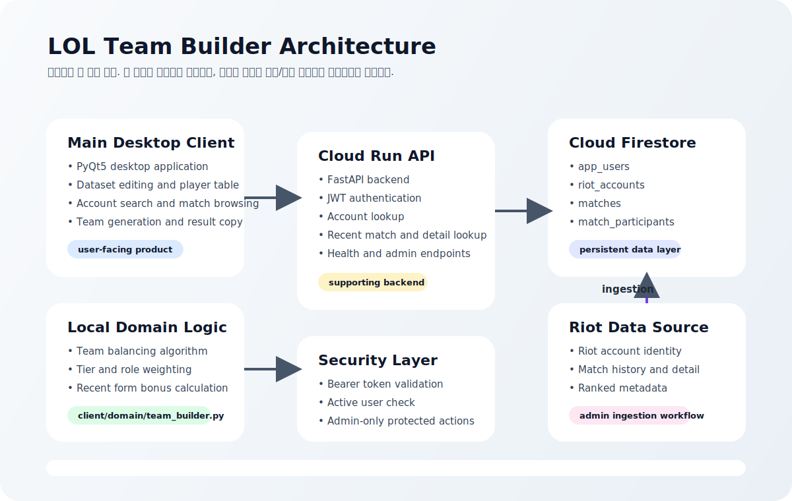

# LOL Team Builder

로컬 팀 생성 알고리즘을 중심으로 두고, Riot 전적 데이터는 `보정`과 `운영 데이터 축적`에 사용하는 데스크톱 + API 프로젝트입니다.

핵심은 [client/domain/team_builder.py](client/domain/team_builder.py) 의 팀 생성 로직입니다.  
클라우드 쪽은 이 핵심을 대체하는 것이 아니라, `저장된 Riot 계정`, `최근 경기 데이터`, `관리 도구`를 제공하는 보조 계층입니다.



## 컨셉

- 팀 생성 알고리즘은 로컬에서 바로 실행됩니다.
- 메인 클라이언트는 Firestore에 저장된 Riot 계정과 최근 경기 데이터를 읽어 팀 빌딩에 참고합니다.
- `riot_loader`는 관리자 전용 운영 도구입니다.
  - Riot API 키를 로컬에서 직접 넣고
  - 친구들의 최근 경기 데이터를 수동/배치로 적재하고
  - Firestore 상태를 모니터링하고 정리합니다.
- 서버는 `Cloud Run + FastAPI + Firestore` 구조를 기준으로 동작합니다.

## 현재 아키텍처

- 메인 앱: `PyQt5` 데스크톱 클라이언트
- 핵심 도메인: 로컬 팀 생성 알고리즘
- 운영 도구: `riot_loader`
- 백엔드: `FastAPI`
- 저장소: `Cloud Firestore`
- 배포 대상: `GCP Cloud Run`

### Firestore 컬렉션

- `app_users`
  - 관리자/앱 사용자 계정
- `riot_accounts`
  - 저장된 Riot 계정 메타데이터
- `matches`
  - 경기 상세 원본 + 요약
- `match_participants`
  - 최근 경기 조회를 빠르게 하기 위한 참가자 인덱스

## 저장소 구조

- [client/](client)
  - 메인 데스크톱 앱
- [client/domain/](client/domain)
  - 핵심 팀 생성 알고리즘
- [client/tools/](client/tools)
  - `riot_loader` 등 운영 도구
- [server/](server)
  - FastAPI 서버
- [deploy/gcp/](deploy/gcp)
  - GCP 배포 문서
- [patch_notes/](patch_notes)
  - 날짜별 패치노트

## 문서 모음

- 배포 가이드: [deploy/gcp/DEPLOY_GCP_CLOUD_RUN_DOCKER.md](deploy/gcp/DEPLOY_GCP_CLOUD_RUN_DOCKER.md)
- 로컬 테스트 가이드: [local_test_guild.md](local_test_guild.md)
- 최신 패치노트: [patch_notes/PATCH_NOTES_2026-05-05.md](patch_notes/PATCH_NOTES_2026-05-05.md)
- 전체 패치노트 폴더: [patch_notes/](patch_notes)

## 빠른 시작

### 1. 가상환경 활성화

```powershell
cd C:\Users\wjddn\OneDrive\Desktop\projects\team_builder
.\.venv\Scripts\Activate.ps1
```

PowerShell 실행 정책 때문에 막히면:

```powershell
Set-ExecutionPolicy -Scope Process -ExecutionPolicy Bypass
```

### 2. 서버 의존성 설치

```powershell
python -m pip install -r server\requirements.txt
```

### 3. Firestore Emulator 기준 서버 실행

```powershell
$env:TEAM_BUILDER_FIRESTORE_EMULATOR_HOST="127.0.0.1:8080"
$env:TEAM_BUILDER_FIRESTORE_PROJECT="demo-team-builder-local"
$env:TEAM_BUILDER_FIRESTORE_DATABASE="(default)"
$env:TEAM_BUILDER_JWT_SECRET="local-dev-secret"
python -m uvicorn server.main:app --reload
```

배포 환경에서는 `TEAM_BUILDER_FIRESTORE_EMULATOR_HOST` 를 설정하지 않으면 됩니다.  
그러면 같은 소스코드가 자동으로 실제 Firestore에 연결됩니다.

### 4. 메인 클라이언트 실행

```powershell
python client\main.py
```

### 5. Riot Loader 실행

```powershell
python -m client.tools.riot_loader
```

더 자세한 로컬 테스트 절차는 [local_test_guild.md](local_test_guild.md) 에 정리되어 있습니다.

## 배포 방향

현재 프로젝트는 `Cloud Run + Firestore` 기준으로 배포하며, 컨테이너 이미지는 `Cloud Build 원격 빌드`를 기본 경로로 사용합니다. 필요하면 Dockerfile 기반 로컬 빌드도 가능합니다. 로컬/배포는 소스코드를 나누지 않고 환경변수 설정으로 분기합니다.

- API 서버는 Cloud Run에 배포
- 저장 데이터는 Firestore에 보관
- Riot API 키는 서버에 상시 보관하지 않고, 관리자 로컬 도구에서 직접 사용 가능
- 친구 데이터는 `riot_loader`로 적재

배포 절차는 [deploy/gcp/DEPLOY_GCP_CLOUD_RUN_DOCKER.md](deploy/gcp/DEPLOY_GCP_CLOUD_RUN_DOCKER.md) 를 기준으로 진행하면 됩니다.
