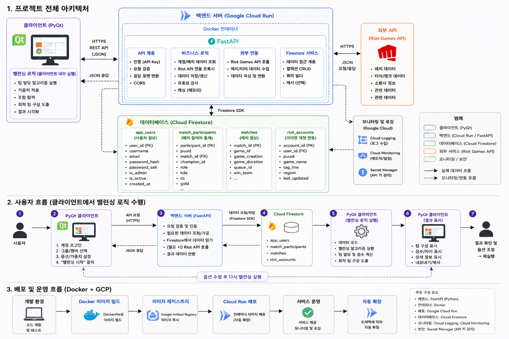

# LOL Team Builder

👉 [최신 빌드 버전 다운로드](https://github.com/ojwojwojw/lol_team_builder/releases/latest)  
🌍 [English README for Riot Review](README_EN.md)

`LOL Team Builder`는 **League of Legends 내전 / 커스텀 게임용 밸런스 팀 생성 데스크톱 앱**입니다.  
핵심은 로컬에서 실행되는 팀 생성 알고리즘이며, 서버는 이를 대체하지 않고 **저장된 계정 정보와 최근 경기 데이터를 보조적으로 제공**합니다.

이 프로젝트는 웹사이트가 아니라 **PyQt5 기반 데스크톱 애플리케이션**입니다.  
따라서 사용자는 로컬 앱을 실행해서 유저를 관리하고 팀을 만들며, 백엔드는 계정/최근 매치 데이터를 조회하는 지원 역할을 맡습니다.

프로젝트를 만든 저는 커스텀 게임을 자주 즐기는 플레이어이자 운영자(`admin`)로서, 함께 플레이하는 친구들의 Riot 데이터를 조회하고 Firestore에 적재해 팀 편성 품질을 높이는 흐름까지 직접 관리하고 있습니다.

Riot API Key는 **최종 사용자에게 노출되지 않으며**, 일반 사용자 기능에서 다뤄지지 않습니다.  
현재는 클라이언트에서 입력받지 않고, 백엔드 서버 환경변수로만 관리합니다.  
실제 Riot API 호출은 모두 백엔드(`FastAPI`)에서 수행되며, 데스크톱 클라이언트가 Riot API와 직접 통신하지 않습니다.

배포 환경에서는 Riot API Key를 **서버 측 환경 변수 및 GCP Secret Manager 기반으로 관리하는 방향**을 기준 운영 정책으로 삼고 있습니다.
사용자 인증 세션은 백엔드에서 발급하는 **JWT 기반 access token**을 사용합니다.

## 프로젝트 목적

- 소규모 그룹이 내전 전에 빠르게 균형 잡힌 팀을 만들 수 있게 돕기
- 단순 티어 합산이 아니라 포지션, 최근 경기 흐름, 저장된 계정 데이터를 함께 고려하기
- 반복적으로 함께 플레이하는 친구 그룹의 데이터를 축적해서 팀 편성 품질을 높이기

## Riot API Key 처리 정책

- Riot API Key는 최종 사용자에게 공개되지 않으며, 클라이언트 애플리케이션에 영구 저장하지 않습니다.
- Riot API Key는 서버 측 환경변수 `TEAM_BUILDER_RIOT_API_KEY`로 관리하며, 필요 시 `RIOT_API_KEY`를 레거시 fallback으로 사용할 수 있습니다.
- 실제 Riot API 요청은 모두 백엔드 서비스에서 수행되며, 클라이언트가 Riot API를 직접 호출하지 않습니다.
- 배포 환경에서는 서버 측 환경 변수와 GCP Secret Manager를 활용하는 형태로 보안 강화를 예정하고 있습니다.

개발 환경에서는 프로젝트 루트의 `.env` 파일을 통해 위 환경변수를 자동 로드할 수 있습니다.

## 정책 준수

- 이 앱은 Riot의 공식 랭킹 체계(MMR, ELO 등)를 복제하거나 대체하려는 목적을 갖지 않습니다.
- 최근 경기, 승률, KDA 등의 데이터는 비공개 커스텀 게임에서 균형 잡힌 팀 편성을 돕기 위한 참고 정보로만 사용합니다.
- 플레이어를 공개적으로 평가하거나 낙인찍는 용도로 사용하지 않습니다.

## 서비스 범위

- 이 프로젝트는 소규모 비공개 그룹 전용 도구이며, 공개 서비스나 대규모 사용자 대상 플랫폼이 아닙니다.
- 친구들끼리 진행하는 내전과 커스텀 게임을 위한 데스크톱 유틸리티 형태로 운영됩니다.

## 데이터 수집 및 요청 정책

- Riot API 데이터는 작은 배치 단위로 제한적으로 수집하며, 공식 rate limit을 준수하는 방향으로 운영합니다.
- 이미 조회한 데이터는 Firestore에 저장하고 재사용하여 불필요한 반복 요청을 줄입니다.

## 디스클레이머

이 프로젝트는 Riot Games의 공식 후원, 인증 또는 제휴를 받은 서비스가 아닙니다.

## 기술 스택

### 데스크톱 클라이언트
- `Python 3.12`
- `PyQt5`
- `QSS` 테마 시스템 (`dark.qss`, `light.qss`)

### 핵심 로직
- `client/domain/team_builder.py`
- 로컬 실행형 팀 생성 알고리즘

### 백엔드
- `FastAPI`
- `PyJWT`
- `google-cloud-firestore`

### 인프라
- `Google Cloud Run`
- `Cloud Firestore`

## 아키텍처

### 1. Main Desktop Client
- 사용자가 직접 실행하는 메인 앱입니다.
- 유저 표 편집, 계정 검색, 최근 매치 확인, 팀 생성, 결과 복사를 담당합니다.
- 실제 팀 생성 알고리즘은 이 앱 안에서 로컬로 실행됩니다.

### 2. Team Builder Domain Logic
- 프로젝트의 핵심입니다.
- 티어, 세부 티어, 포지션, 최근 경기 폼 등을 반영해 팀 균형을 계산합니다.

### 3. Cloud Run API
- 계정 인증
- 저장된 Riot 계정 조회
- 최근 매치 조회
- 경기 상세 조회
- JWT 기반 access token 발급 및 검증

이 API는 **데스크톱 앱의 보조 계층**이며, 핵심 팀 생성 자체는 로컬 앱이 담당합니다.

### 4. Cloud Firestore
- 앱 계정
- 저장된 Riot 계정
- 경기 원본
- 최근 경기 조회용 참가자 인덱스

### 5. Riot Data Ingestion
- 관리자 흐름에서 Riot 데이터를 적재합니다.
- 이 부분은 사용자용 메인 앱이 아니라 운영/관리 도구에서 수행합니다.
- 운영자는 서버에 설정된 Riot API 환경변수를 통해 최근 경기, 계정 메타데이터, 티어 정보를 Firestore에 적재합니다.

## 화면별 용도

### 1. Riot 적재 도구 메인 화면

- 관리자가 특정 Riot ID를 조회하고 최근 경기 데이터를 확인한 뒤 Firestore 적재를 수행하는 운영 화면입니다.
- 수동 적재와 저장된 계정 일괄 적재를 한 화면에서 처리할 수 있습니다.
- Riot API 키는 이 화면에서 입력하지 않으며, 서버 환경변수로 관리됩니다.

### 2. 배치 스케줄러 화면

- 저장된 계정을 선택해 작은 배치 단위로 순차 적재하는 화면입니다.
- 최근 경기 수, 배치 크기, 실행 간격을 조정해 장시간 적재 작업을 관리할 수 있습니다.
- 이 화면 역시 Riot API 키 입력란 없이 동작하며, 적재 요청은 서버에 설정된 환경변수를 사용합니다.

### 3. Firestore 관리 화면

- 컬렉션별 문서 수와 용량을 확인하고, 문서 목록 및 상세 JSON을 점검하는 운영 보조 화면입니다.
- 오래된 데이터 정리나 적재 결과 검증 용도로 사용합니다.
- Riot API 키는 이 모니터링 화면과 분리되어 있으며, 운영 환경에서는 서버 환경변수로만 관리합니다.

### 4. 메인 팀 빌더 화면

- 데이터셋 편집, 유저 선택, 계정 검색, 최근 경기 분석, 팀 생성 결과 확인까지 핵심 사용자 흐름이 모여 있는 메인 작업 화면입니다.
- 왼쪽은 로컬 팀 편성 표, 오른쪽은 검색 및 분석 패널, 상단은 생성된 팀 결과 영역으로 구성됩니다.

### 5. 조합 선택 근거 팝업

- 생성된 팀 조합이 왜 선택되었는지 점수 항목별로 설명하는 분석 팝업입니다.
- 팀 총점 차이, 라인 점수 차이, 포지션 패널티, 최근 폼 반영값 등을 함께 보여줍니다.

### 6. 팀 점수 계산식 팝업

- 각 유저의 기본점수, 세부랭크 배율, 티어 가중치, 최근 폼 배율이 어떻게 합산되는지 식 단위로 보여주는 화면입니다.
- 운영자나 사용자 모두 팀 밸런싱 로직을 검증하는 데 사용할 수 있습니다.

### 7. 경기 상세 보기 팝업

- 최근 경기 목록에서 선택한 한 경기의 참가자별 상세 기록을 확인하는 화면입니다.
- 소환사, 챔피언, 포지션, 승패, KDA, CS, 피해량, 시야 수치를 한 번에 검토할 수 있습니다.

## 실행 화면과 동작

## 1. 로그인 화면

로그인 창에서 사용자는:

- 서버 주소 입력
- 아이디 입력
- 비밀번호 입력
- 저장 세션 초기화

를 수행할 수 있습니다.

특징:
- 아이디 입력칸은 기본값 대신 `아이디를 입력해주세요` 안내 문구를 보여줍니다.
- 로컬 세션이 꼬였을 때 `저장 세션 초기화` 버튼으로 토큰과 사용자명을 정리할 수 있습니다.

## 2. 메인 작업 화면

메인 화면은 크게 두 영역으로 나뉩니다.

### 왼쪽: 데이터셋 / 유저 표
- 데이터셋 생성
- 데이터셋 복사
- 데이터셋 삭제
- 유저 추가 / 삭제
- 선택 체크
- 포지션 조정
- 커플 그룹 지정

여기서 사용자는 팀 생성에 사용할 로컬 유저 목록을 직접 관리합니다.

### 오른쪽: 계정 조회 / 최근 경기 / 결과
- 계정 검색
- 전체 유저 검색
- 최근 매치 목록
- 포지션 통계
- 챔피언 통계
- 팀 생성 결과

## 3. 계정 검색과 최근 경기 확인

사용자는 오른쪽 분석 패널에서:

- 게임명으로 계정 검색
- 저장된 전체 계정 목록 조회
- 특정 계정 선택
- 최근 경기와 요약 통계 확인

을 할 수 있습니다.

최근 경기 영역에서 확인 가능한 정보:
- 경기 시각
- 챔피언
- 포지션
- 승패
- K/D/A
- CS
- 시야 점수
- 챔피언 대상 피해량
- 골드

요약 영역에서 확인 가능한 정보:
- 최근 경기 수
- 최근 승수 / 패수
- 최근 승률
- 평균 KDA
- 평균 CS
- 포지션 통계
- 챔피언 통계

## 4. 유저를 팀 빌더 표에 반영

검색한 계정을 선택한 뒤 `선택 유저 추가`를 누르면:

- Riot ID
- 티어 / 세부 티어
- 최근 경기 수
- 최근 승률
- 최근 KDA
- 선호 포지션 추정치

가 현재 데이터셋 표에 반영됩니다.

즉 사용자는 “검색만 하는 화면”이 아니라, **검색 결과를 팀 빌딩 입력값으로 바로 흡수**할 수 있습니다.

## 5. 팀 생성

팀 생성 흐름은 단순합니다.

1. 사용할 유저를 표에서 선택
2. 필요하면 포지션과 티어를 수정
3. `팀 생성` 클릭
4. 결과 확인
5. `복사` 버튼으로 공유

결과 화면에는:
- 팀 A / 팀 B 구성
- 포지션 적합도
- 최근 폼 반영 결과
- 경고 / 주의 메시지

가 포함됩니다.

## 6. 경기 상세 보기

최근 경기 목록에서 특정 경기를 선택하면 `경기 상세 보기`를 열 수 있습니다.

여기서는 참가자 기준으로:
- 소환사명
- 챔피언
- 포지션
- 승패
- KDA
- CS
- 피해량
- 시야 점수

를 확인할 수 있습니다.

## 핵심 기능 요약

- 로컬 팀 생성 알고리즘
- 데이터셋 기반 반복 사용
- 계정 검색 및 전체 유저 검색
- 최근 매치 기반 폼 확인
- 경기 상세 조회
- 팀 결과 복사
- 로컬 세션 초기화 / 로그아웃

## Firestore 컬렉션

### `app_users`
- 앱 로그인 계정 저장

### `riot_accounts`
- 저장된 Riot 계정 메타데이터

### `matches`
- 경기 원본 상세 데이터

### `match_participants`
- 최근 매치 조회용 참가자 인덱스

참고:
- 최근 매치 조회는 `matches`를 직접 읽는 것이 아니라 주로 `match_participants`를 기준으로 동작합니다.

## 저장 구조와 사용자 데이터

메인 앱은 로컬에도 일부 설정을 저장합니다.

예:
- 서버 주소
- 테마
- 저장된 로그인 세션

관련 파일:
- `client/data/config.json`

## 문서 모음

- 영어 README: [README_EN.md](README_EN.md)
- 로컬 환경변수 파일: 프로젝트 루트 `.env` (gitignore 대상)
- 로컬 테스트 가이드: [local_test_guild.md](local_test_guild.md)
- GCP 배포 문서: [deploy/gcp/DEPLOY_GCP_CLOUD_RUN.md](deploy/gcp/DEPLOY_GCP_CLOUD_RUN.md)
- 패치 노트: [patch_notes/](patch_notes)
- 최근 매치 조회 장애 리포트: [patch_notes/INCIDENT_REPORT_2026-05-05_MATCH_LOOKUP.md](patch_notes/INCIDENT_REPORT_2026-05-05_MATCH_LOOKUP.md)

## 프로젝트 구조

- [client/](client)
  - 메인 데스크톱 앱
- [client/domain/](client/domain)
  - 핵심 팀 생성 알고리즘
- [client/ui/](client/ui)
  - 화면 구성
- [server/](server)
  - FastAPI 백엔드
- [docs/images/](docs/images)
  - README용 아키텍처 및 화면 설명 이미지
- [deploy/gcp/](deploy/gcp)
  - GCP 배포 문서

## 참고

이 프로젝트는 **웹사이트 중심 서비스**가 아니라 **데스크톱 앱 중심 구조**입니다.

즉 Riot API 심사 관점에서도 핵심은:
- 사용자가 로컬 앱을 실행해 기능을 사용한다는 점
- 서버는 계정 / 경기 데이터 제공 계층이라는 점
- 핵심 팀 생성 알고리즘은 로컬에서 직접 실행된다는 점
- Riot 데이터는 비공개 그룹의 공정한 내전 진행을 돕는 참고 정보로만 사용된다는 점

입니다.
