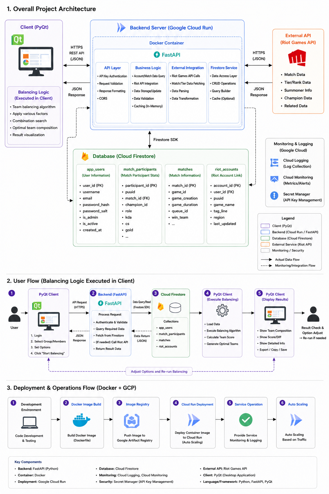
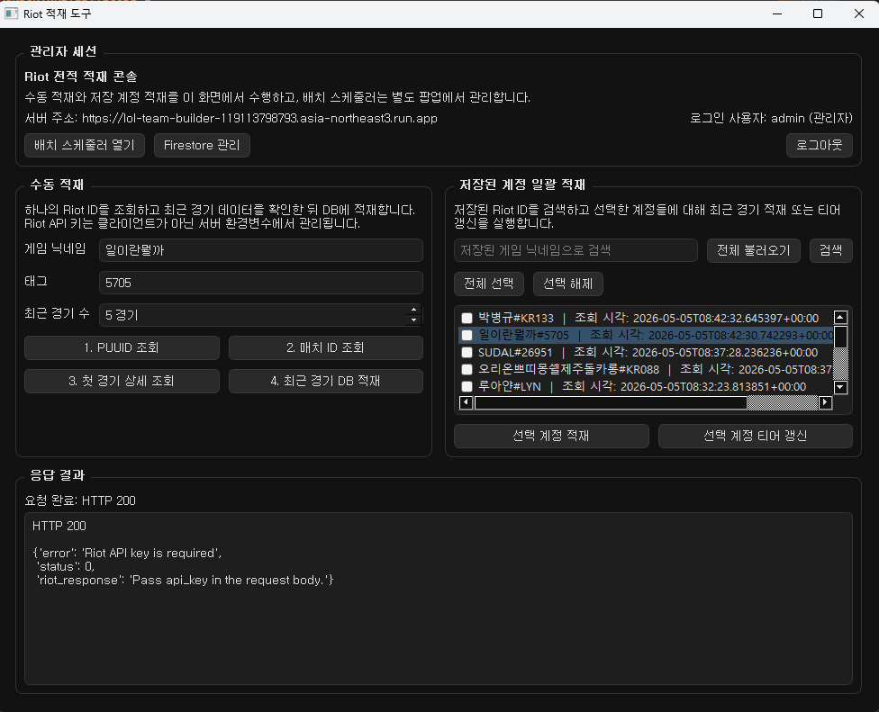
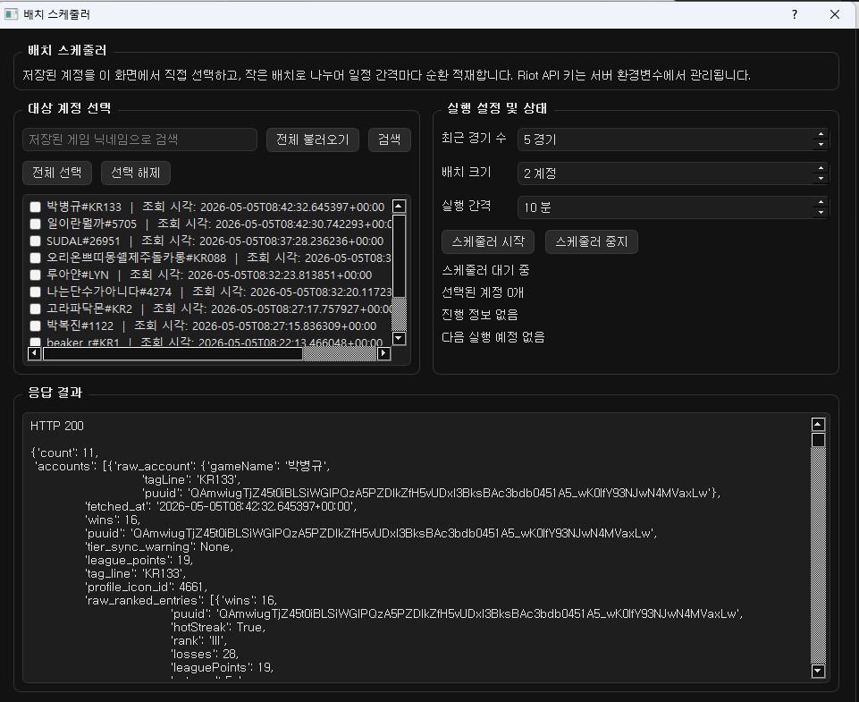
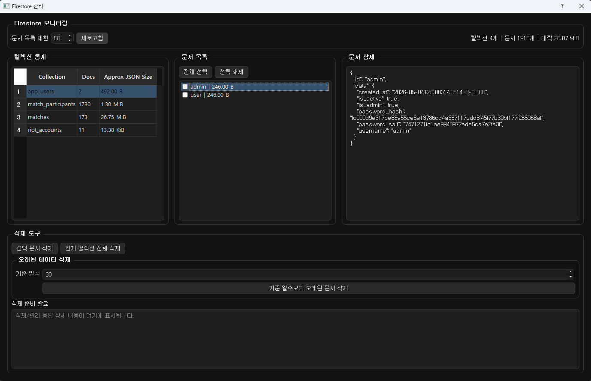

# LOL Team Builder

[Latest Build Download](https://github.com/ojwojwojw/lol_team_builder/releases/latest)  
[Korean README](README.md)

`LOL Team Builder` is a **desktop-first League of Legends team balancing application** for custom games and in-house matches.

The core value of the product is a **local team generation algorithm** executed inside a PyQt5 desktop client.  
The backend does not replace the main logic. Instead, it provides supporting data such as stored Riot accounts, recent match summaries, and match detail records.

This project is **not a public website product**. It is a **PyQt5 desktop application backed by a small cloud API**.

I built this project as someone who frequently runs custom games with friends and also acts as the group `admin`. In practice, I manage the flow of loading friend account data from the Riot API into Firestore so team generation can use more consistent player data over time.

The Riot API key is **never exposed to end users** and is not part of the normal user workflow.  
It is managed only through backend server environment variables.  
All Riot API requests are executed by the backend (`FastAPI`) service, and the desktop client does not communicate with the Riot API directly.

For deployment, the intended operating policy is to manage the Riot API key through **server-side environment variables and GCP Secret Manager**.
User authentication sessions are handled with **JWT-based access tokens** issued by the backend.

## What the product does

- Helps small groups create fair custom teams
- Lets users search stored player accounts
- Shows recent match summaries and player trends
- Adds searched players directly into a local team-building dataset
- Generates balanced teams using local logic

## Riot API Key Handling

- The Riot API key is never exposed to end users and is not persisted in the client application.
- It is managed through the server-side `TEAM_BUILDER_RIOT_API_KEY` environment variable, with `RIOT_API_KEY` accepted as a legacy fallback.
- All Riot API requests are executed exclusively on the backend service.
- The desktop client never directly communicates with the Riot API.
- In the deployed environment, the intended secret-management model is server-side environment variables with GCP Secret Manager.

For local development, the backend can auto-load these variables from a project-root `.env` file.

## Policy Compliance

- This application does not attempt to replicate or replace Riot's official ranking systems such as MMR or ELO.
- Player-related data such as recent matches, win rate, and KDA are used only as reference inputs for private custom games.
- The goal is to help small private groups organize fair teams, not to publicly rank, shame, or judge players.

## Scope of the Project

- This project is intended only for small private groups and is not a public-facing service.
- It is a desktop-based utility tool for in-house matches among friends.

## Data Usage and Rate Limiting

- Riot API data is collected in controlled, small batches with rate-limit awareness.
- Previously fetched data is stored and reused to reduce unnecessary repeat requests.

## Disclaimer

This project is not endorsed by or affiliated with Riot Games.

## Why it exists

Many small groups running custom games still create teams manually by guessing player strength.  
This project is designed to make that process more structured and repeatable.

Instead of only comparing rank, the app can also use:
- preferred roles
- recent match trends
- recent win rate
- recent KDA
- stored player metadata

## Product format

This is a **desktop application** built with `PyQt5`.

The cloud backend is used only to:
- authenticate app users
- read stored Riot account information
- read recent match summaries
- read match detail data

The main team-building workflow happens inside the desktop app.

## Tech stack

### Desktop client
- `Python 3.12`
- `PyQt5`
- `QSS` themes

### Core logic
- `client/domain/team_builder.py`

### Backend
- `FastAPI`
- `PyJWT`
- `google-cloud-firestore`

### Infrastructure
- `Google Cloud Run`
- `Cloud Firestore`

## Architecture

### 1. Main Desktop Client
The user-facing application.

Responsibilities:
- login
- dataset editing
- account search
- recent match browsing
- team generation
- result copying

### 2. Team Builder Domain Logic
The core algorithm layer.

Responsibilities:
- balancing players
- combining tier and role information
- reflecting recent form
- producing final team output

### 3. Cloud Run API
Supporting backend API.

Responsibilities:
- user authentication
- account lookup
- recent match lookup
- match detail lookup
- JWT-based access token issuance and verification

### 4. Cloud Firestore
Persistent storage for:
- app users
- stored Riot accounts
- match detail documents
- participant-based recent match indexes

### 5. Riot Data Ingestion
Admin-side operational flow for:
- loading Riot account metadata
- importing recent matches
- refreshing tier and profile data
- writing normalized records into Firestore

## Screen reference

### 1. Riot ingestion console

This is the main admin console showing the current admin session, manual ingestion tools, bulk ingestion tools for stored accounts, and the response panel in one workspace.  
The left side supports manual Riot ID based ingestion, while the right side handles bulk storage and tier refresh for saved accounts.
The Riot API key is not exposed on this screen and is managed through server environment variables.

### 2. Batch scheduler

This screen is used to schedule repeated ingestion in small batches for selected stored accounts.  
The admin can control recent-match count, batch size, and execution interval for longer-running refresh jobs.
This scheduler also runs without a client-side API key field and relies on the server's configured environment variable.

### 3. Firestore monitor

This is the Firestore monitoring screen for checking collection statistics, browsing documents, reviewing raw JSON, and using cleanup tools.  
It is used for ingestion-result validation and operational cleanup.
Riot API key handling is separated from this monitor and is managed only through server-side environment variables.

### 4. Main team builder workspace

This is the primary user workspace where dataset editing, player selection, account search, recent-match analysis, and team generation come together.  
The left side manages the local roster table, while the right side focuses on lookup and analysis.

### 5. Team selection rationale popup

This popup explains why a generated team combination was selected.  
It breaks down factors such as total score gap, lane score difference, preferred-position penalties, and recent-form adjustments.

### 6. Team score formula popup

This popup shows the actual score formula used for each player.  
It exposes the combination of base score, sub-rank multiplier, tier weight, and recent-form multiplier for validation and review.

### 7. Match detail dialog

This dialog shows participant-level detail for a selected recent match.  
Users can inspect summoner names, champions, roles, outcomes, KDA, CS, damage, and vision in one place.

## Main user flow

## 1. Login screen

Users enter:
- server URL
- username
- password

The login dialog also supports:
- clearing saved local session state

## 2. Main workspace

The main screen is split into two large areas.

### Left side
- dataset list
- create / copy / delete dataset
- local user table

### Right side
- account search
- full account list loading
- recent match summary
- position statistics
- champion statistics
- team result area

## 3. Account search and player lookup

Users can:
- search by Riot game name
- load all stored accounts
- select one account
- inspect recent match summaries

Displayed recent-match information includes:
- match time
- champion
- role / position
- win or loss
- K/D/A
- CS
- vision score
- champion damage
- gold

## 4. Add searched players into the team builder

After selecting an account, the user can add that player directly into the local team-building table.

The app can carry over:
- Riot ID
- tier / rank detail
- recent match count
- recent win rate
- recent KDA
- preferred positions

## 5. Team generation

Typical workflow:

1. choose players
2. adjust positions or tiers if needed
3. generate teams
4. review result
5. copy result for sharing

The result includes:
- Team A / Team B composition
- role fit impact
- recent form impact
- warnings and balancing notes

## 6. Match detail view

Users can open a match detail dialog from the recent match list.

This shows participant-level information such as:
- summoner name
- champion
- role
- win/loss
- KDA
- CS
- damage
- vision

## Firestore collections

### `app_users`
Application login accounts

### `riot_accounts`
Stored Riot account metadata

### `matches`
Full match detail documents

### `match_participants`
Participant-based index for recent match lookups

Important:
- recent match browsing is primarily backed by `match_participants`
- full match detail is stored in `matches`

## Local app state

The desktop app also stores local configuration such as:
- server URL
- theme mode
- saved login session

Related file:
- `client/data/config.json`

## Documents

- Korean README: [README.md](README.md)
- Local environment file: project-root `.env` (gitignored)
- Local test guide: [local_test_guild.md](local_test_guild.md)
- GCP deployment guide: [deploy/gcp/DEPLOY_GCP_CLOUD_RUN.md](deploy/gcp/DEPLOY_GCP_CLOUD_RUN.md)
- Incident report: [patch_notes/INCIDENT_REPORT_2026-05-05_MATCH_LOOKUP.md](patch_notes/INCIDENT_REPORT_2026-05-05_MATCH_LOOKUP.md)

## Reviewer note

For Riot review purposes:

- this product is a **desktop utility app**
- not a public consumer website
- the main functionality is executed locally in the client
- Riot data is used to support player review and team balancing
- the backend is a supporting data service, not the primary product surface
- the app is intended only for small private groups running custom games
