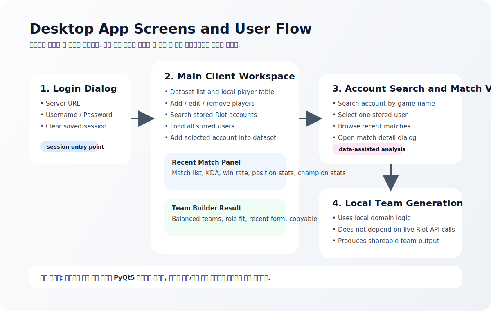

# LOL Team Builder

[Latest Build Download](https://github.com/ojwojwojw/lol_team_builder/releases/latest)  
[Korean README](README.md)

`LOL Team Builder` is a **desktop-first League of Legends team balancing application** for custom games and in-house matches.

The core value of the product is a **local team generation algorithm** executed inside a PyQt5 desktop client.  
The backend does not replace the main logic. Instead, it provides supporting data such as stored Riot accounts, recent match summaries, and match detail records.

This project is **not a public website product**. It is a **PyQt5 desktop application backed by a small cloud API**.

## What the product does

- Helps small groups create fair custom teams
- Lets users search stored player accounts
- Shows recent match summaries and player trends
- Adds searched players directly into a local team-building dataset
- Generates balanced teams using local logic

## Why it exists

Many small groups running custom games still create teams manually by guessing player strength.  
This project is designed to make that process more structured and repeatable.

Instead of only comparing rank, the app can also use:
- preferred roles
- recent match trends
- recent win rate
- recent KDA
- stored player metadata

## Product format

This is a **desktop application** built with `PyQt5`.

The cloud backend is used only to:
- authenticate app users
- read stored Riot account information
- read recent match summaries
- read match detail data

The main team-building workflow happens inside the desktop app.

## Tech stack

### Desktop client
- `Python 3.12`
- `PyQt5`
- `QSS` themes

### Core logic
- `client/domain/team_builder.py`

### Backend
- `FastAPI`
- `PyJWT`
- `google-cloud-firestore`

### Infrastructure
- `Google Cloud Run`
- `Cloud Firestore`

## Architecture

### 1. Main Desktop Client
The user-facing application.

Responsibilities:
- login
- dataset editing
- account search
- recent match browsing
- team generation
- result copying

### 2. Team Builder Domain Logic
The core algorithm layer.

Responsibilities:
- balancing players
- combining tier and role information
- reflecting recent form
- producing final team output

### 3. Cloud Run API
Supporting backend API.

Responsibilities:
- user authentication
- account lookup
- recent match lookup
- match detail lookup

### 4. Cloud Firestore
Persistent storage for:
- app users
- stored Riot accounts
- match detail documents
- participant-based recent match indexes

## Main user flow

## 1. Login screen

Users enter:
- server URL
- username
- password

The login dialog also supports:
- clearing saved local session state

## 2. Main workspace

The main screen is split into two large areas.

### Left side
- dataset list
- create / copy / delete dataset
- local user table

### Right side
- account search
- full account list loading
- recent match summary
- position statistics
- champion statistics
- team result area

## 3. Account search and player lookup

Users can:
- search by Riot game name
- load all stored accounts
- select one account
- inspect recent match summaries

Displayed recent-match information includes:
- match time
- champion
- role / position
- win or loss
- K/D/A
- CS
- vision score
- champion damage
- gold

## 4. Add searched players into the team builder

After selecting an account, the user can add that player directly into the local team-building table.

The app can carry over:
- Riot ID
- tier / rank detail
- recent match count
- recent win rate
- recent KDA
- preferred positions

## 5. Team generation

Typical workflow:

1. choose players
2. adjust positions or tiers if needed
3. generate teams
4. review result
5. copy result for sharing

The result includes:
- Team A / Team B composition
- role fit impact
- recent form impact
- warnings and balancing notes

## 6. Match detail view

Users can open a match detail dialog from the recent match list.

This shows participant-level information such as:
- summoner name
- champion
- role
- win/loss
- KDA
- CS
- damage
- vision

## Firestore collections

### `app_users`
Application login accounts

### `riot_accounts`
Stored Riot account metadata

### `matches`
Full match detail documents

### `match_participants`
Participant-based index for recent match lookups

Important:
- recent match browsing is primarily backed by `match_participants`
- full match detail is stored in `matches`

## Local app state

The desktop app also stores local configuration such as:
- server URL
- theme mode
- saved login session

Related file:
- `client/data/config.json`

## Documents

- Korean README: [README.md](README.md)
- Local test guide: [local_test_guild.md](local_test_guild.md)
- GCP deployment guide: [deploy/gcp/DEPLOY_GCP_CLOUD_RUN.md](deploy/gcp/DEPLOY_GCP_CLOUD_RUN.md)
- Incident report: [patch_notes/INCIDENT_REPORT_2026-05-05_MATCH_LOOKUP.md](patch_notes/INCIDENT_REPORT_2026-05-05_MATCH_LOOKUP.md)

## Reviewer note

For Riot review purposes:

- this product is a **desktop utility app**
- not a public consumer website
- the main functionality is executed locally in the client
- Riot data is used to support player review and team balancing
- the backend is a supporting data service, not the primary product surface
